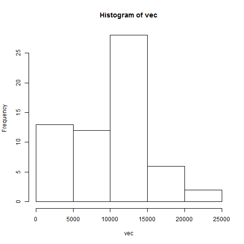
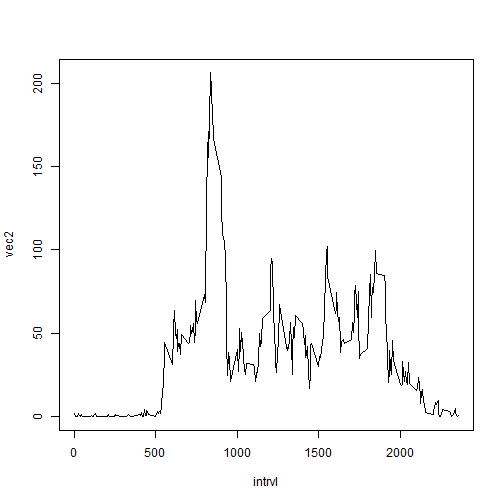
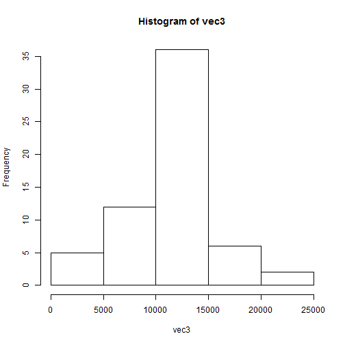
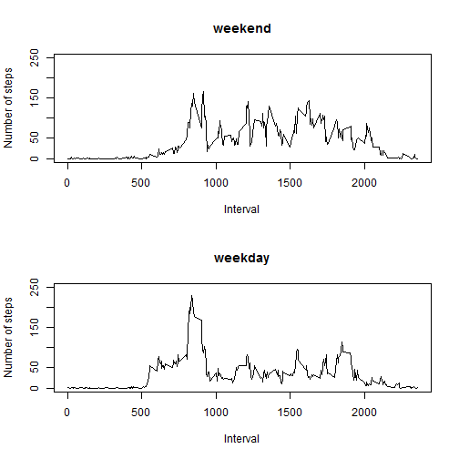

```r
dat <- read.csv("activity.csv", header = T) #load data

spl <- split(dat,dat$date) #split data by date
vec = vector('numeric') #initialize vector
for(i in 1:length(spl)){
  vec[i] <- sum(spl[[i]]$steps, na.rm=TRUE)
}
hist(vec) #histogram
```

 

```r
mean(vec) #mean
```

```
## [1] 9354.23
```

```r
median(vec) #median
```

```
## [1] 10395
```

```r
spl2 <- split(dat,dat$interval) #split data by interval
vec2 = vector('numeric') #initialize vector
for(i in 1:length(spl2)){
  vec2[i] <- mean(spl2[[i]]$steps, na.rm=TRUE)
}
max <- which.max(vec2)
intrvl <- spl[[1]]$interval
plot(intrvl,vec2,type="l",col="black") #plot
```

 

```r
intrvl[max] #max
```

```
## [1] 835
```

```r
sum(is.na(dat)) #NA rows
```

```
## [1] 2304
```

```r
#use mean for 5-min intervals to replace NAs
for(i in 1:nrow(dat)){
  if(is.na(dat[i,1])){
    index <- match(dat[i,3],intrvl)
    dat[i,1] <- vec2[index]
  }
}
new_dat <- dat #new data after filling in NAs
spl3 <- split(new_dat,new_dat$date) #split data by date
vec3 = vector('numeric') #initialize vector
for(i in 1:length(spl3)){
  vec3[i] <- sum(spl3[[i]]$steps, na.rm=TRUE)
}
hist(vec3) #histogram
```

 

```r
mean(vec3) #mean
```

```
## [1] 10766.19
```

```r
median(vec3) #median
```

```
## [1] 10766.19
```

```r
new_dat$day <- weekdays(as.Date(new_dat$date)) #add column with days of week
#create weekday/weekend column
for(i in 1:nrow(new_dat)){
  if(new_dat[i,4]=="Sunday" | new_dat[i,4]=="Saturday"){
    new_dat[i,5] <- "weekend"
  }
  else{
    new_dat[i,5] <- "weekday"
  }
}
spl4 <- split(new_dat,list(new_dat$interval,new_dat$V5)) #split data by interval
vec4 = vector('numeric') #initialize vector
vec5 = vector('numeric') #initialize vector
for(i in 1:288){
  vec4[i] <- mean(spl4[[i]]$steps, na.rm=TRUE)
}
for(i in 289:576){
  vec5[i-288] <- mean(spl4[[i]]$steps, na.rm=TRUE)
}
par(mfrow=c(2,1))
plot(intrvl,vec5,type="l",xlab="Interval",ylab="Number of steps",main="weekend",ylim=c(0,250))
plot(intrvl,vec4,type="l",xlab="Interval",ylab="Number of steps",main="weekday",ylim=c(0,250))
```

 

